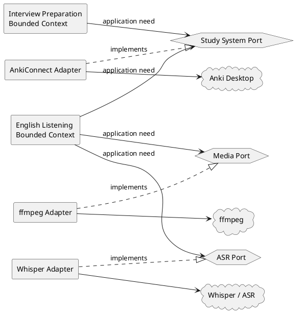

# Context Map

## Purpose

Make bounded-context ownership and integration direction explicit.

## Current bounded contexts

### Interview Preparation

Owns the model for technical-interview preparation:

```text
Competency
Concept
LearningTask
QuestionType
Question
Attempt
Assessment
Gap
LearningAction
```

It decides what should be learned/tested and how interview evidence is interpreted.

### English Listening

Owns the model for listening practice from authentic media:

```text
MediaSource
TranscriptOccurrence
LexicalTarget
ASR/alignment result
ListeningSegment
playback/audio policy
```

It decides what spoken-language evidence is useful and how stable listening material is derived from source media.

## External systems

The following are not bounded contexts of the learning domain:

- Anki / AnkiConnect;
- ffmpeg;
- Whisper / ASR providers;
- filesystem / JSON persistence;
- future web/CLI UI;
- LLM providers.

They are external mechanisms integrated through adapters.

## Context map



The diagram is conceptual. A shared `StudySystemPort` should only exist in code after equivalent semantics are proven in both use cases. Until then, bounded contexts may own separate ports implemented by the same infrastructure package.

## Relationship rules

### Between bounded contexts

There is no direct domain dependency between Interview Preparation and English Listening.

Allowed:

```text
Interview application -> shared technical capability
Listening application -> shared technical capability
```

Not allowed:

```text
Interview domain -> Listening domain
Listening domain -> Interview domain
```

If future analytics genuinely requires cross-context concepts, define an explicit integration model rather than importing one domain model into the other.

### Bounded context → Anki

Each bounded context/application layer owns its semantic projection.

Examples:

```text
Question -> interview-specific study projection
ListeningSegment -> listening-specific study projection
```

The shared Anki infrastructure owns only generic transport/reconciliation behavior.

### English Listening → media/ASR

`MediaSource`, source provenance, transcript occurrences, alignment policy, and segment identity remain inside English Listening. ffmpeg/Whisper adapters execute capabilities but do not own these meanings.

## No universal learning context yet

Do not create a shared `Learning`, `Exercise`, `StudyItem`, or `Mastery` bounded context solely because both workflows use Anki.

Extraction requires demonstrated shared semantics, not shared tooling.
